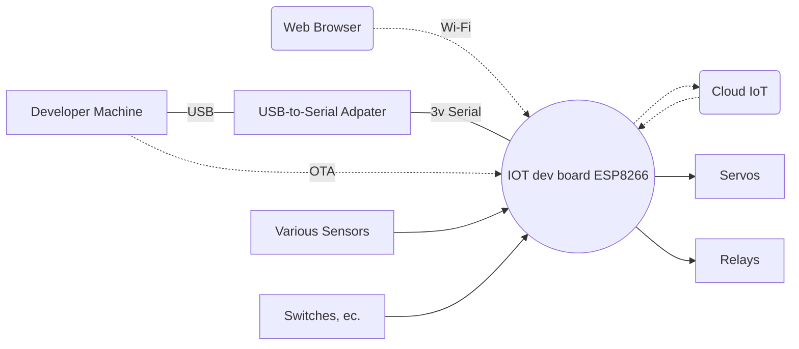
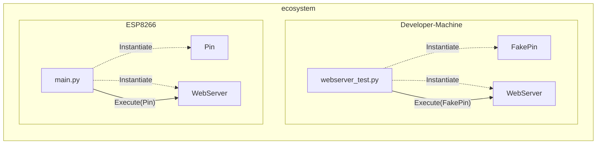
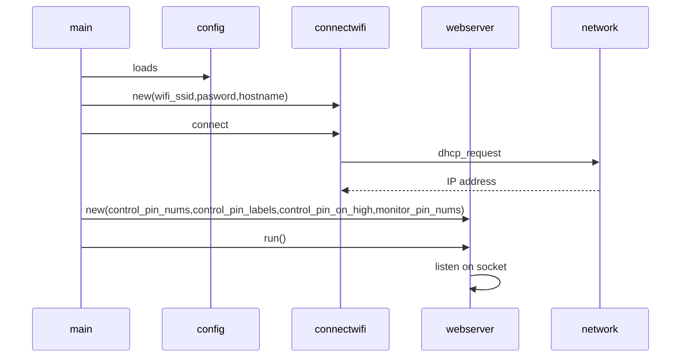
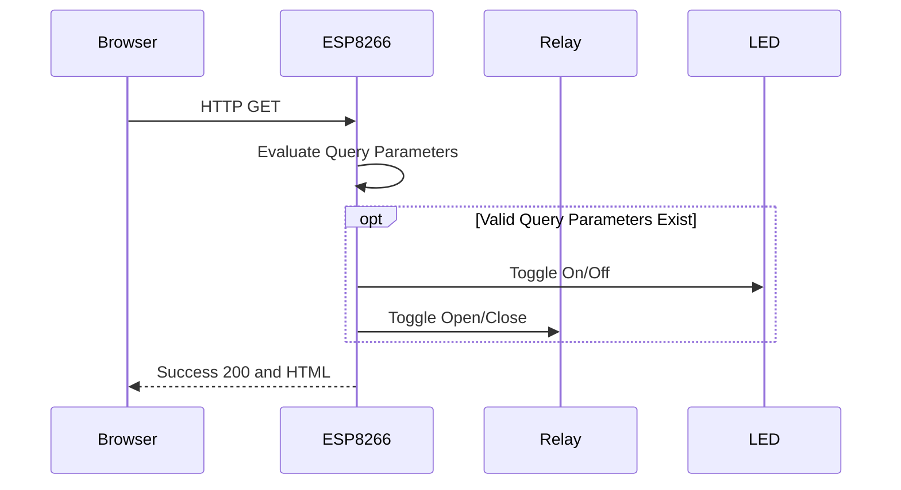

This project was tested with version 1.9.1 on a generic ESP8266 board.  



# MicroPython
Load MicroPython onto your board.  See https://joe.blog.freemansoft.com/2022/11/flashing-micropython-onto-generic.html

# Setup
## Required Hardware 
1. ESP8266 IoT board or better
1. Computer with USB port
1. USB-to-Serial adapter that fits into the computer
    1. Used an old Prolific, possibly counterfeit, USB-to-3.3V cable on my Mac that showed up as `/dev/cu.usbserial-1140`ls
    1. Used an old UsbBee on my Windows machine that showed up as `COM6`
1. 3 wire cable from the adapter to the IoT board
1. Plug the USB-to-Serial adapter into the computer and into the IoT board.  A COM or serial port should magially appear. If not, you may need to install drivers

## Command Line Tools (rshell)
This document assumes you use rshell to push and pull changes from your IoT device running micropython. The default board name in `rshell` is `pyboard`  This means that `rshell` refers to the IOT device file system as `/pyboard` no matter who made the board.

## Software Setup 
1. Install IDE (I use VisualCode)
1. Install rshell with pip https://pypi.org/project/rshell/
    1. `python3 -m pip install rshell`
    1. Add the python install location to your path if the pip install _tells you_ it is not on path. pip will provide the path. The path is non intuitive on Windows. 
        * The message probably says something like _is installed in &lt;some path&gt; which is not on PATH_ and _Consider adding this diretory to PATH_
        * Mine Windows 10 path was `C:\Users\joe\AppData\Local\Packages\PythonSoftwareFoundation.Python.3.9_qbz5n2kfra8p0\LocalCache\local-packages\Python39\Scripts`
1. Clone this repo
1. Copy `config-template.py.template` to `config.py` and put your `ssid`, `password` and `hostname` values into `config.py`
    * `wifi_ssid` and `wifi_password` must be provided in the configuration file to join the local network.  The program currently fails if it can't join the network.
    * hostname: The hostname can appear in your DHCP name table after the device joins the network if your router supports that.  
        * In my case a `hostname` of `FreemanFrak` became a DNS entry of `freemanfrak.fios-router.home`
        * I have also seen `FreemanFrak.local`
1. rshell: Run `rshell`
    1. With the port on the command line
        1. Windows Style: `rshell -p COM6`
        1. Mac Style: `rshell -p /dev/cu.usbserial-1140`
    1. Specifying the port after starting `rshell`
        1. Windows Style: `connect serial COM6` or whatever your COM port is on Microsoft Windows
        1. Mac Style: `connect serial /dev/cu.usbserial-1140` or whatever your serial port is on a Mac.
1. Edit `main.py` to customize the device pins the web server will display.  A sample from the code 12/2022 is as follows
    ```
    server = WebServer(
        [machine.Pin(2, machine.Pin.OUT), machine.Pin(16, machine.Pin.OUT)],
        ["LED (Pin 2)", "RELAY (Pin 16)"],
        [False, True],
        [machine.Pin(i) for i in [0, 2, 4, 5, 12, 13, 14, 15, 16]],
    )
    ```
1. rshell
    ``` 
    cp config.py /pyboard
    cp connectwifi.py /pyboard
    cp httpget.py /pyboard
    cp main.py /pyboard
    cp toggle.py /pyboard
    cp webserver.py /pyboard
    ```

# Running and testing the web server.
Most people will just run the server on their device per the instructions above

This repository also contains a test jig that lets you run the server on your local development machine.  It currently only supports basic output pins and logs the operations it runs.  



| Execution Environment | Steps |
| - | - |
| Iot Device | Copy the files and restart the device|
| Development machine like a mac | Run `pytest -s` to start a server and see log output.  Press `ctrl-c` to exit the test.

# Web Server
The device will actually bring up two different networks and have two different addresses if you provid valid `SSID` and `Password` for the local network.

## Joining your network in Station
This program attempts to join the network specified in the config.py file. It will a acquire a DHCP issued IP address and log that to the console. This network must be successfully configured and joined in order to have internet access.

In some networks the board will be registered and reachable as `<hostname>.local`. _This worked fine for me with a Verizon FIOS router_.  Other routers don't pick this up and you have to connect by IP address. 

## AP Mode
MicroPython starts a network in Access Point (AP) mode. This means the IoT device actually hosts its own private network with no internet connectivity.

1. The ESP8266 IoT board has its own access point named `MicroPyton-<serial>`. 
1. You can join the AP network with password `micropythoN` 
1. Then connect to the project web server with a browser at `192.168.4.1`. 

# Network Initialization Sequence
This is the initialization sequence



# Web Request / Response



# Open Issues
1. Assumes `Pin.value()` returns correct pin state for `Pin.OUT` pins when docs say _The behaviour and return value of the method is undefined._
1. Must manually create config.py and populate with the values.
1. OTA not enabled.
1. Portal on first boot to enter network credentials not supported

# Exercising the Scripts
You can exercise the utilities in this package from the REPL. This assumes that you have 
1. Correctly configured config.py
1. Copied the files to the ESP8266 as specified above

## If you're using rshell
1. Start `rshell` or whatever command line interace you are using
    ```
    rshell -p <your-serial-port>
    ```
1. Enter the REPL from `rshell` with 
    ```
    repl
    ```

## The easy way
This assumes you are at the REPL prompt

1. Run `main()`
    ```
    from main import main
    main()
    ```
1. Use a web browser to connect to the web page at the address shown.
1. Terminate the MicroPython program - if you want to play more with the REPL
    ```
    ctrl-c
    ```
1. Exit the REPL with
    ```
    ctrl-x
    ```

## The long way
Basically we are running main() line by line

1. Connect to local wifi with
    ```
    from config import wifi_ssid, wifi_password
    from connectwifi import WIFI
    conn = WIFI(wifi_ssid, wifi_password, hostname)
    conn.do_connect()
    ```
1. Now flash the lights
    ```
    from toggle import toggle_pin
    toggle_pin(2,1000,10)
    ```
1. Make a web request to a remote server
    ```
    from httpget import http_get_print
    http_get_print("http://micropython.org/ks/test.html")
    ```
1. Start up a web page and hit the IP address from your browser
    ```
    from webserver import WebServer
    server = WebServer([machine.Pin(2, machine.Pin.OUT), machine.Pin(16, machine.Pin.OUT)],["LED (Pin 2)", "RELAY (Pin 16)"],[False, True],[machine.Pin(i) for i in [2, 16]])
    server.run_server()
    ```


## Restart the board to run boot() and main()

Restart the board or run these commands from REPL
```
import machine
machine.reset()
```

## Sample Output running main() from REPL

```
C:\Users\joe\Documents\GitHub\MicroPython> repl
Entering REPL. Use Control-X to exit.
>
MicroPython v1.19.1 on 2022-06-18; ESP module with ESP8266
Type "help()" for more information.
>>> from main import main
>>> main()
    network config: ('192.168.1.238', '255.255.255.0', '192.168.1.1', '192.168.1.1')
    HTTP/1.1 200 OK
    Server: nginx/1.10.3
    Date: Sat, 19 Nov 2022 02:02:10 GMT
    Content-Type: text/html
    Content-Length: 180
    Last-Modified: Tue, 03 Dec 2013 00:16:26 GMT
    Connection: close
    Vary: Accept-Encoding
    ETag: "529d22da-b4"
    Strict-Transport-Security: max-age=15768000
    Accept-Ranges: bytes

    <!DOCTYPE html>
    <html lang="en">
        <head>
            <title>Test</title>
        </head>
        <body>
            <h1>Test</h1>
            It's working if you can read this!
        </body>
    </html>
>>> from toggle import toggle
>>> toggle_pin(2,500)
    _control-c_
Traceback (most recent call last):
  File "<stdin>", line 1, in <module>
  File "toggle.py", line 14, in toggle
KeyboardInterrupt:
>>>
    _control-x_
```

## pinging to find the full name.  
I set my hostname to FreemanFrak which resulted in the following
```
C:\GitHub\ESP8266-MicroPython>ping FreemanFrak

Pinging FreemanFrak.fios-router.home [192.168.1.238] with 32 bytes of data:
Reply from 192.168.1.238: bytes=32 time=1ms TTL=255
Reply from 192.168.1.238: bytes=32 time=2ms TTL=255
Reply from 192.168.1.238: bytes=32 time=2ms TTL=255
Reply from 192.168.1.238: bytes=32 time=1ms TTL=255
```

# Open Issues
1. There is a trailing / prior to the query parameter start `/?`
1. The server may suffer from buffer overrun attacks

# References
Used while initially creating this

ESP8266 

MicroPython
* https://docs.micropython.org/en/latest/esp8266/tutorial
* https://docs.micropython.org/en/latest/esp8266/tutorial/intro.html Using esptool to flash MicroPython onto 8266 board 
* https://docs.micropython.org/en/latest/esp8266/tutorial/network_tcp.html
* https://docs.micropython.org/en/latest/esp8266/tutorial/filesystem.html
* https://forum.micropython.org/viewtopic.php?f=2&t=7969
* https://blog.miguelgrinberg.com/post/micropython-and-the-internet-of-things-part-iii-building-a-micropython-application
* https://techtutorialsx.com/2017/06/06/esp32-esp8266-micropython-automatic-connection-to-wifi/

Web Server Examples some based on the same core
* https://randomnerdtutorials.com/esp32-esp8266-micropython-web-server/
* https://randomnerdtutorials.com/micropython-esp32-esp8266-vs-code-pymakr/ Web server that handles GET query parameters
* https://microcontrollerslab.com/esp32-esp8266-micropython-web-server/ Web server that handles GET requests
* https://github.com/micropython/micropython/blob/master/docs/esp8266/tutorial/network_tcp.rst

rshell
* https://github.com/dhylands/rshell

Other : Wemos D1 cause that is compatible with the board I tested with.
* https://www.wemos.cc/en/latest/tutorials/d1/get_started_with_micropython_d1.html
* https://www.instructables.com/MicroPython-IoT-Rover-Based-on-WeMos-D1-ESP-8266EX/
* https://micropython-on-wemos-d1-mini.readthedocs.io/en/latest/index.html
* https://micropython-on-wemos-d1-mini.readthedocs.io/en/latest/setup.html
Other: General
* https://randomnerdtutorials.com/esp8266-pinout-reference-gpios/
* https://randomnerdtutorials.com/esp32-esp8266-analog-readings-micropython/
* https://github.com/pvanallen/esp32-getstarted/blob/master/docs/servo.md
* https://github.com/pvanallen/esp32-getstarted/blob/master/examples/servo.py
* https://randomnerdtutorials.com/esp32-esp8266-analog-readings-micropython/

