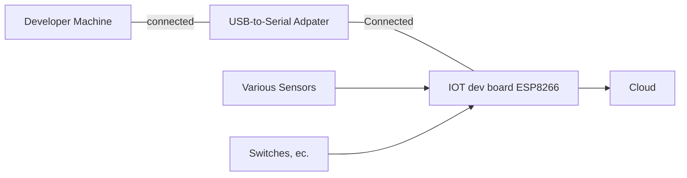

This project was tested with version 1.9.1 on a generic ESP8266 board.  



# MicroPython
Load MicroPython onto your board.  See https://joe.blog.freemansoft.com/2022/11/flashing-micropython-onto-generic.html

# rshell
This document assumes you use rshell to push and pull changes from your IoT device running micropython

The default board name in `rshell` is `pyboard`  This means that `rshell` refers to the IOT device file system as `/pyboard`.

# Setup 
1. Install IDE (I use VisualCode)
1. Install rshell with pip https://pypi.org/project/rshell/
    1. `python3 -m pip install rshell`
    1. Add the python install location to your path if the pip install _tells you_ it is not on path. pip will provide the path. The path is non intuitive on Windows. 
        * The message probably says something like _is installed in &lt;some path&gt; which is not on PATH_ and _Consider adding this diretory to PATH_
        * Mine Windows 10 path was `C:\Users\joe\AppData\Local\Packages\PythonSoftwareFoundation.Python.3.9_qbz5n2kfra8p0\LocalCache\local-packages\Python39\Scripts`
1. Clone this repo
1. Copy `config-template.py.template` to `config.py` and put your values into `config.py`
    * 
    *
    * hostname: The hostname should appear in your DHCP name table.  In my case a `hostname` of `FreemanFrak` became a DNS entry of `freemanfrak.fios-router.home`
1. rshell
    1. `connect serial COM6` or whatever your com port is
1. rshell
``` 
cp config.py /pyboard
cp connectwifi.py /pyboard
cp httpget.py /pyboard
cp main.py /pyboard
cp toggle.py /pyboard
cp webserver.py /pyboard
```


# Exercising the Scripts
You can exercise the utilities in this package from the REPL. This assumes that you have 
1. Correctly configured config.py
1. Pushed the files to the ESP8266 as specified above

Enter the REPL from `rshell` with 
```
repl
```
Connect to local wifi with
```
from config import ssid, password
from connectwifi import WIFI
conn = WIFI(ssid, password, hostname)
conn.do_connect()
```
Now flash the lights
```
from toggle import toggle_pin
toggle_pin(2,1000,10)
```
Make a web request to a remote server
```
from httpget import http_get_print
http_get_print("http://micropython.org/ks/test.html")
```
Start up a web page and hit the IP address from your browser
```
from webserver import WebServer
server = WebServer("LED",2, False, "Relay", 16, True)
server.run_server()
```

Do all of this by running main()
```
from main import main
main()
```
Terminate the MicroPython program
```
ctrl-c
```
Exit the REPL with
```
ctrl-x
```

## Restart the board to run boot() and main()

Restart the board or run these commands from REPL
```
import machine
machine.reset()
```

## Sample Output running main() from REPL

```
C:\Users\joe\Documents\GitHub\MicroPython> repl
Entering REPL. Use Control-X to exit.
>
MicroPython v1.19.1 on 2022-06-18; ESP module with ESP8266
Type "help()" for more information.
>>> from main import main
>>> main()
    network config: ('192.168.1.238', '255.255.255.0', '192.168.1.1', '192.168.1.1')
    HTTP/1.1 200 OK
    Server: nginx/1.10.3
    Date: Sat, 19 Nov 2022 02:02:10 GMT
    Content-Type: text/html
    Content-Length: 180
    Last-Modified: Tue, 03 Dec 2013 00:16:26 GMT
    Connection: close
    Vary: Accept-Encoding
    ETag: "529d22da-b4"
    Strict-Transport-Security: max-age=15768000
    Accept-Ranges: bytes

    <!DOCTYPE html>
    <html lang="en">
        <head>
            <title>Test</title>
        </head>
        <body>
            <h1>Test</h1>
            It's working if you can read this!
        </body>
    </html>
>>> from toggle import toggle
>>> toggle_pin(2,500)
    _control-c_
Traceback (most recent call last):
  File "<stdin>", line 1, in <module>
  File "toggle.py", line 14, in toggle
KeyboardInterrupt:
>>>
    _control-x_
```

## pinging to find the full name.  
I set my hostname to FreemanFrak which resulted in the following
```
C:\GitHub\ESP8266-MicroPython>ping FreemanFrak

Pinging FreemanFrak.fios-router.home [192.168.1.238] with 32 bytes of data:
Reply from 192.168.1.238: bytes=32 time=1ms TTL=255
Reply from 192.168.1.238: bytes=32 time=2ms TTL=255
Reply from 192.168.1.238: bytes=32 time=2ms TTL=255
Reply from 192.168.1.238: bytes=32 time=1ms TTL=255
```

# References
Used while initially creating this

ESP8266 

MicroPython
* https://docs.micropython.org/en/latest/esp8266/tutorial
* https://docs.micropython.org/en/latest/esp8266/tutorial/intro.html Using esptool to flash MicroPython onto 8266 board 
* https://docs.micropython.org/en/latest/esp8266/tutorial/network_tcp.html
* https://docs.micropython.org/en/latest/esp8266/tutorial/filesystem.html
* https://forum.micropython.org/viewtopic.php?f=2&t=7969
* https://blog.miguelgrinberg.com/post/micropython-and-the-internet-of-things-part-iii-building-a-micropython-application
* https://techtutorialsx.com/2017/06/06/esp32-esp8266-micropython-automatic-connection-to-wifi/

Web Server Examples based on the same core
* https://randomnerdtutorials.com/esp32-esp8266-micropython-web-server/
* https://randomnerdtutorials.com/micropython-esp32-esp8266-vs-code-pymakr/ Web server that handles GET query parameters
* https://microcontrollerslab.com/esp32-esp8266-micropython-web-server/ Web server that handles GET requests

rshell
* https://github.com/dhylands/rshell

Other : Wemos D1 cause that is compatible with the board I tested with.
* https://www.wemos.cc/en/latest/tutorials/d1/get_started_with_micropython_d1.html
* https://www.instructables.com/MicroPython-IoT-Rover-Based-on-WeMos-D1-ESP-8266EX/
* https://micropython-on-wemos-d1-mini.readthedocs.io/en/latest/index.html
* https://micropython-on-wemos-d1-mini.readthedocs.io/en/latest/setup.html
