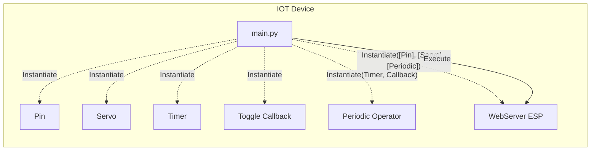
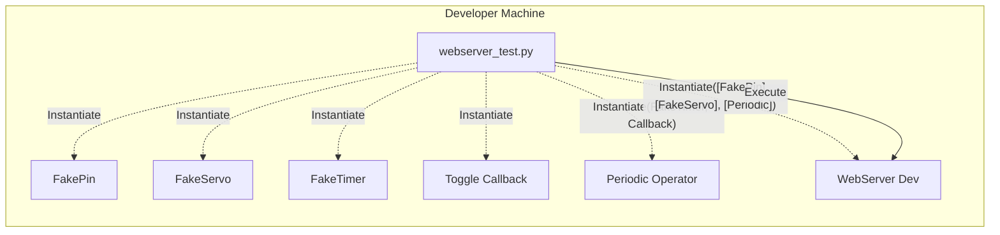
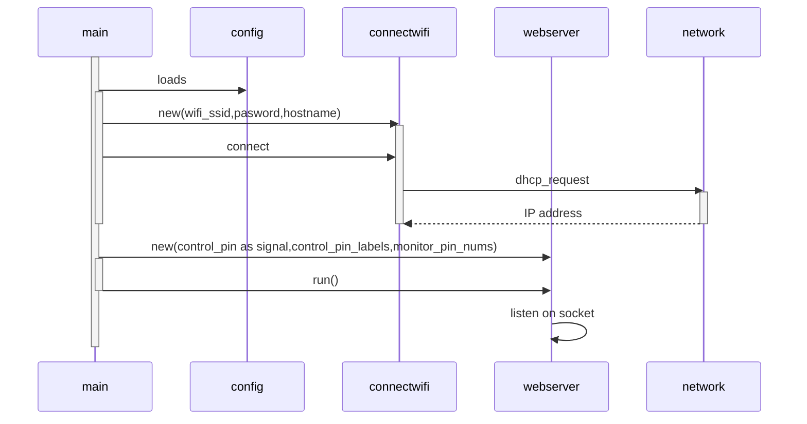
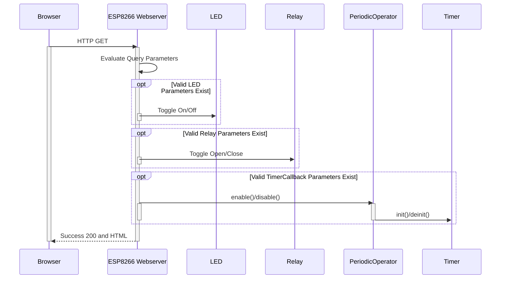
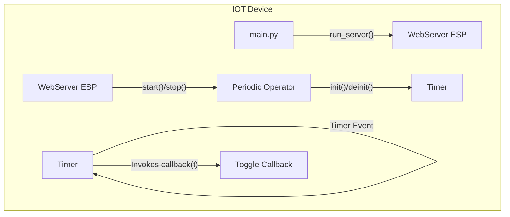
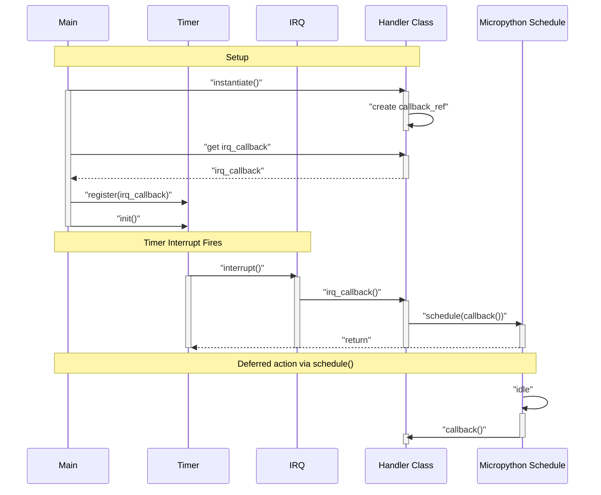

This project was tested with version 1.9.1 on a generic ESP8266 board.  


# MicroPython
Load MicroPython onto your board.  See https://joe.blog.freemansoft.com/2022/11/flashing-micropython-onto-generic.html for an example with `esptool`.


# Setup
## Required Hardware 
1. IoT board that supports Micropython.  ESP8266 or better.  
    * Tested with ESP8266. Micropython installed via `esptools`
    * Tested with Pico W.  Micropython installed via `uf2` boot loader
    * Tested with Seeed Studio ESP32C3 XAIO.  Micropython installed via `esptools` 
        * That really didn't work well with the Micropython avaialble 2022/12. Looks like a sleep state issue
1. Computer with USB port
1. USB-to-Serial adapter that fits into the computer
    1. Used an old Prolific, possibly counterfeit, USB-to-3.3V cable on my Mac that showed up as `/dev/cu.usbserial-1140`ls
    1. Used an old USBee on my Windows machine that showed up as `COM6`. Required cable from adapter to device.
    1. Used an old arduino FTDI adapter from 2011. Required cable from adapter to device.
1. Plug the USB-to-Serial adapter into the computer and into the IoT board.  A COM or serial port should magially appear. If not, you may need to install drivers

## Command Line Tools (rshell)
This document assumes you use rshell to push and pull changes from your IoT device running micropython. The default board name in `rshell` is `pyboard`  This means that `rshell` refers to the IOT device file system as `/pyboard` no matter who made the board.

## Software Setup 
1. Install IDE (I use VisualCode)
1. Install rshell with pip https://pypi.org/project/rshell/
    1. `python3 -m pip install rshell`
    1. Add the python install location to your path if the pip install _tells you_ it is not on path. pip will provide the path. The path is non intuitive on Windows. 
        * The message probably says something like _is installed in &lt;some path&gt; which is not on PATH_ and _Consider adding this diretory to PATH_
        * Mine Windows 10 path was `C:\Users\joe\AppData\Local\Packages\PythonSoftwareFoundation.Python.3.9_qbz5n2kfra8p0\LocalCache\local-packages\Python39\Scripts`
1. Clone this repo
1. Copy `config-template.py.template` to `config.py` and put your `ssid`, `password` and `hostname` values into `config.py`
    * `wifi_ssid` and `wifi_password` must be provided in the configuration file to join the local network.  The program currently fails if it can't join the network.
    * hostname: The hostname can appear in your DHCP name table after the device joins the network if your router supports that.  
        * In my case a `hostname` of `FreemanFrak` became a DNS entry of `freemanfrak.fios-router.home`
        * I have also seen `FreemanFrak.local`
1. rshell: Run `rshell`
    1. With the port on the command line
        1. Windows Style: `rshell -p COM6`
        1. Mac Style: `rshell -p /dev/cu.usbserial-1140`
    1. Specifying the port after starting `rshell`
        1. Windows Style: `connect serial COM6` or whatever your COM port is on Microsoft Windows
        1. Mac Style: `connect serial /dev/cu.usbserial-1140` or whatever your serial port is on a Mac.
1. Edit `main.py` to customize the device pins the web server will display.  Pass an an empty list if none of that class. A sample from the code 12/2022 is as follows:
    ```
    server = WebServer(
        [Signal(Pin(2, Pin.OUT), True), Signal(Pin(16, Pin.OUT), False)],
        ["LED (Pin 2)", "RELAY (Pin 16)"],
        ["Servo 1"],
        [Pin(<a pin>)],
        [PeriodicOperators]
        [PeriodicLabels]
        [Pin(i) for i in [0, 2, 4, 5, 12, 13, 14, 15, 16]],
        "some message for the bottom"
    )
    ```
1. rshell
    ``` 
    cp config.py /pyboard
    cp connectwifi.py /pyboard
    cp httpget.py /pyboard
    cp main.py /pyboard
    cp periodicoperator.py /pyboard
    cp servo.py / pyboard
    cp flashpin.py /pyboard
    cp togglepin.py /pyboard
    cp webserver.py /pyboard
    ```

# Running and testing the web server.
Most people will just run the server on their device per the instructions above

This repository also contains a test jig that lets you run the server on your local development machine.  It currently only supports basic output pins and logs the operations it runs.  

### ESP8266


### Developer Machine


| Execution Environment | Steps |
| - | - |
| Iot Device | Copy the files and restart the device|
| Development machine like a mac | Run `pytest -s` to start a server and see log output.  Press `ctrl-c` to exit the test.

* Note that you must install pytest `python3 -m pip install pytest`

# Web Server
The device will actually bring up two different networks and have two different addresses if you provid valid `SSID` and `Password` for the local network.

## Joining your network in Station
This program attempts to join the network specified in the config.py file. It will a acquire a DHCP issued IP address and log that to the console. This network must be successfully configured and joined in order to have internet access.

In some networks the board will be registered and reachable as `<hostname>.local`. _This worked fine for me with a Verizon FIOS router_.  Other routers don't pick this up and you have to connect by IP address. 

## AP Mode
MicroPython starts a network in Access Point (AP) mode. This means the IoT device actually hosts its own private network with no internet connectivity.

1. The ESP8266 IoT board has its own access point named `MicroPyton-<serial>`. 
1. You can join the AP network with password `micropythoN` 
1. Then connect to the project web server with a browser at `192.168.4.1`. 

# Network Initialization Sequence
This is the initialization sequence



# Web Request / Response

The webserver accepts GET requests and updates the devices I/O peripherals based on the query parameters.



# Timed Behavior
There is a timed event handler demonstration in the code.  It is all drivern by a Timer callback.  

There is only one virtual timer on an ESP8266 so only one timed callback can be invoked. The includes a pin toggler and a servo sweeper.  Enable one or the other in main.py

The example Timer pieces have 3 main phases.
1. Inject a timer and callback into the web server
1. Start and Stop the Timer via web request which map to init() and deinit()
1. Invoke callback() on timer interrupt




## Periodic Operator
This project includes wrapper that binds a `Periodic Timer` with a `Callback Function`. The operator exists to provide a single object that can be injected into other module like the web server in this project.  


## Timer Callback
1. Create a Timer
1. Create a Callback function
1. Create an Operator containinging both
1. Pass the operator to some web or other reponse handler.
1. The handler can then turn on and off the timer essentially enabling and disabling the periodic event. 
    1. The simplest example is that this lets you create a blinking LED without blocking the rest of your program


## Scheduled Callback Deferral 

ServoSweep Callback relies on deferred execution because it allocates memory. The servo sweep example has some math and other operations.  That code may not be safe so the servosweep callback handler uses `machine.schedule()` to push the servo targeting work back onto the main thread where heap allocations can occure.  The `togglepin.py` and `servosweep.py` both do this the same way with the same callback function tname.



# Open Issues - TODO
Run Time
1. Assumes `Pin.value()` returns correct pin state for `Pin.OUT` pins when docs say _The behaviour and return value of the method is undefined._
1. Disable HTML page generation if the caller doesn't accept HTML.
1. Should add portal (AP on first boot to enter network credentials.
1. Web UI
    1. Sync the slider to the value shown in the page currently for the slider
    1. Slider is the only AJAX call that doesn't refresh page so weird different behavior - probably should refresh to be accurate

Development Time
1. Must manually create config.py and populate with the values.
1. OTA not enabled.
1. There is no obvious way to figure out what pins are supported on a given board via API
1. The Wi-Fi status codes are different from board to board
1. The sleep state codes are different from board to board both in number and in naming.

Test Time
1. Test runs the server but doesn't actually test or close the server

## Compatibility issues
Some of the boards use 10 bit pwm and some use 16 bit pwm. Duty cycles must be converted appropriately. The Servo class compensates for this.  The API accepts values that are converted into duty cycles.

# Exercising the Scripts
You can exercise the utilities in this package from the REPL. This assumes that you have 
1. Correctly configured config.py
1. Copied the files to the ESP8266 as specified above

## If you're using rshell
1. Start `rshell` or whatever command line interace you are using
    ```
    rshell -p <your-serial-port>
    ```
1. Enter the REPL from `rshell` with 
    ```
    repl
    ```

## The easy way
This assumes you are at the REPL prompt possibly from rshell

1. Run `main()`
    ```
    from main import main
    main()
    ```
1. Use a web browser to connect to the web page at the address shown.
1. Terminate the MicroPython program - if you want to play more with the REPL
    ```
    ctrl-c
    ```
1. Soft reboot the device. Reboot the REPL. 
    ```
    ctrl-d
    ```
1. Exit the REPL with
    ```
    ctrl-x
    ```

## The long way
Basically we are running main() line by line.  Copy and past each section from main.py into the repl prompt.

These instructions are conceptual **are out of date** for the current code base.
1. Connect to local wifi with
    ```
    from config import wifi_ssid, wifi_password
    from connectwifi import WIFI
    conn = WIFI(wifi_ssid, wifi_password, hostname)
    conn.do_connect()
    ```
1. Now flash the lights
    ```
    from flashpin import flash_pin
    flash_pin(2,1000,10)
    ```
1. Make a web request to a remote server
    ```
    from httpget import http_get_print
    http_get_print("http://micropython.org/ks/test.html")
    ```
1. Start up a web page and hit the IP address from your browser
    ```
    from webserver import WebServer
    server = WebServer(....)
    server.run_server()
    ```


## Restart the board to run boot() and main()

Restart the board or run these commands from REPL
```
import machine
machine.reset()
```

## Sample Output running main() from REPL

```
C:\Users\joe\Documents\GitHub\MicroPython> repl
Entering REPL. Use Control-X to exit.
>
MicroPython v1.19.1 on 2022-06-18; ESP module with ESP8266
Type "help()" for more information.
>>> from main import main
>>> main()
    network config: ('192.168.1.238', '255.255.255.0', '192.168.1.1', '192.168.1.1')
    HTTP/1.1 200 OK
    Server: nginx/1.10.3
    Date: Sat, 19 Nov 2022 02:02:10 GMT
    Content-Type: text/html
    Content-Length: 180
    Last-Modified: Tue, 03 Dec 2013 00:16:26 GMT
    Connection: close
    Vary: Accept-Encoding
    ETag: "529d22da-b4"
    Strict-Transport-Security: max-age=15768000
    Accept-Ranges: bytes

    <!DOCTYPE html>
    <html lang="en">
        <head>
            <title>Test</title>
        </head>
        <body>
            <h1>Test</h1>
            It's working if you can read this!
        </body>
    </html>
>>> from flashpin import flash_pin
>>> flash_pin(2,500)
    _control-c_
Traceback (most recent call last):
  File "<stdin>", line 1, in <module>
  File "flashpin.py", line 14, in flash_pin
KeyboardInterrupt:
>>>
    _control-x_
```

## pinging to find the full name.  
I set my hostname to FreemanFrak which resulted in the following
```
C:\GitHub\ESP8266-MicroPython>ping FreemanFrak

Pinging FreemanFrak.fios-router.home [192.168.1.238] with 32 bytes of data:
Reply from 192.168.1.238: bytes=32 time=1ms TTL=255
Reply from 192.168.1.238: bytes=32 time=2ms TTL=255
Reply from 192.168.1.238: bytes=32 time=2ms TTL=255
Reply from 192.168.1.238: bytes=32 time=1ms TTL=255
```

# Open Issues
1. The server may suffer from buffer overrun attacks
1. Browsers often open up a 2nd request immediately to improve the browser performance.  The timeout on the conn has been set to give  you some time to click around in the browser before the connection times out.  
    1. This means you may have to hit reload in the browser to allow the teset harness to terminate after a control c
1. Servo values aren't validated as integers and may crash web server if non integers are provided
1. FakeTimer does not actually fire periodic actions and is essentially a stub

# References
Used while initially creating this

ESP8266 

MicroPython
* https://docs.micropython.org/en/latest/esp8266/tutorial
* https://docs.micropython.org/en/latest/esp8266/tutorial/intro.html Using esptool to flash MicroPython onto 8266 board 
* https://docs.micropython.org/en/latest/esp8266/tutorial/network_tcp.html
* https://docs.micropython.org/en/latest/esp8266/tutorial/filesystem.html
* https://forum.micropython.org/viewtopic.php?f=2&t=7969
* https://blog.miguelgrinberg.com/post/micropython-and-the-internet-of-things-part-iii-building-a-micropython-application
* https://techtutorialsx.com/2017/06/06/esp32-esp8266-micropython-automatic-connection-to-wifi/
* https://github.com/dhylands/upy-examples Concise examples including callback class
* https://forums.raspberrypi.com/viewtopic.php?t=307218 PWM and duty_16t()-vs-duty() 16bit-vs-10bit 65535-vs-1024

Web Server Examples some based on the same core
* https://randomnerdtutorials.com/esp32-esp8266-micropython-web-server/
* https://randomnerdtutorials.com/micropython-esp32-esp8266-vs-code-pymakr/ Web server that handles GET query parameters
* https://microcontrollerslab.com/esp32-esp8266-micropython-web-server/ Web server that handles GET requests
* https://github.com/micropython/micropython/blob/master/docs/esp8266/tutorial/network_tcp.rst

rshell
* https://github.com/dhylands/rshell

jquery / javascript
* I forgot to capture some of these that helped
* https://stackoverflow.com/questions/5376431/wildcards-in-jquery-selectors
* https://stackoverflow.com/questions/10640159/key-for-javascript-dictionary-is-not-stored-as-value-but-as-variable-name
* https://api.jquery.com/jquery.get/

Other : Wemos D1 cause that is compatible with the board I tested with.
* https://www.wemos.cc/en/latest/tutorials/d1/get_started_with_micropython_d1.html
* https://www.instructables.com/MicroPython-IoT-Rover-Based-on-WeMos-D1-ESP-8266EX/
* https://micropython-on-wemos-d1-mini.readthedocs.io/en/latest/index.html
* https://micropython-on-wemos-d1-mini.readthedocs.io/en/latest/setup.html

Other: General
* https://randomnerdtutorials.com/esp8266-pinout-reference-gpios/
* https://randomnerdtutorials.com/esp32-esp8266-analog-readings-micropython/
* https://github.com/pvanallen/esp32-getstarted/blob/master/docs/servo.md
* https://github.com/pvanallen/esp32-getstarted/blob/master/examples/servo.py
* https://randomnerdtutorials.com/esp32-esp8266-analog-readings-micropython/
* https://howtomechatronics.com/how-it-works/how-servo-motors-work-how-to-control-servos-using-arduino/
* https://docs.micropython.org/en/latest/rp2/quickref.html Raspberry Pi Pico Board 

W3C
* https://www.w3schools.com/colors/colors_names.asp

# Example MicroPython ESP32C3 Micropython 1.9.1
This is an example of the flashing and verification process.  I used `esptool.py` flash the device and `rshell` to interrogate it.
 
## Flash MicroPython to ESP32C3

```
PS C:...> esptool.py --chip esp32c3 --port COM19 erase_flash
esptool.py v4.3
Serial port COM19
Connecting...
Chip is ESP32-C3 (revision v0.4)
Features: WiFi, BLE
Crystal is 40MHz
MAC: 34:85:18:26:f0:78
Uploading stub...
Running stub...
Stub running...
Erasing flash (this may take a while)...
Chip erase completed successfully in 19.4s
Hard resetting via RTS pin...
PS C:...> esptool.py --chip esp32c3 --port COM19 --baud 460800 write_flash -z 0x0 esp32c3-usb-20220618-v1.19.1.bin
esptool.py v4.3
Serial port COM19
Connecting...
Chip is ESP32-C3 (revision v0.4)
Features: WiFi, BLE
Crystal is 40MHz
MAC: 34:85:18:26:f0:78
Uploading stub...
Running stub...
Stub running...
Changing baud rate to 460800
Changed.
Configuring flash size...
Flash will be erased from 0x00000000 to 0x0015dfff...
Compressed 1431808 bytes to 868690...
Wrote 1431808 bytes (868690 compressed) at 0x00000000 in 20.0 seconds (effective 572.4 kbit/s)...
Hash of data verified.

Leaving...
Hard resetting via RTS pin...
```

## Verify Board ESP32C3

```
C:\...> repl
Entering REPL. Use Control-X to exit.
>
MicroPython v1.19.1 on 2022-06-18; ESP32C3 module with ESP32C3
Type "help()" for more information.
>>> help('modules')
__main__          framebuf          uasyncio/stream   uplatform
_boot             gc                ubinascii         urandom
_onewire          inisetup          ubluetooth        ure
_thread           math              ucollections      uselect
_uasyncio         micropython       ucryptolib        usocket
_webrepl          neopixel          uctypes           ussl
apa106            network           uerrno            ustruct
btree             ntptime           uhashlib          usys
builtins          onewire           uheapq            utime
cmath             uarray            uio               utimeq
dht               uasyncio/__init__ ujson             uwebsocket
ds18x20           uasyncio/core     umachine          uzlib
esp               uasyncio/event    uos               webrepl
esp32             uasyncio/funcs    upip              webrepl_setup
flashbdev         uasyncio/lock     upip_utarfile     websocket_helper
Plus any modules on the filesystem

>>> import machine
>>> dir(machine)
['__class__', '__name__', 'ADC', 'ADCBlock', 'DEEPSLEEP', 'DEEPSLEEP_RESET', 'EXT0_WAKE', 'EXT1_WAKE', 'HARD_RESET', 'I2C', 'PIN_WAKE', 'PWM', 'PWRON_RESET', 'Pin', 'RTC', 'SLEEP', 'SOFT_RESET', 'SPI', 'Signal', 'SoftI2C', 'SoftSPI', 'TIMER_WAKE', 'TOUCHPAD_WAKE', 'Timer', 'UART', 'ULP_WAKE', 'WDT', 'WDT_RESET', 'bitstream', 'deepsleep', 'disable_irq', 'enable_irq', 'freq', 'idle', 'lightsleep', 'mem16', 'mem32', 'mem8', 'reset', 'reset_cause', 'sleep', 'soft_reset', 'time_pulse_us', 'unique_id', 'wake_reason']

>>> dir('esp')
['__class__', 'count', 'endswith', 'find', 'format', 'index', 'isalpha', 'isdigit', 'islower', 'isspace', 'isupper', 'join', 'lower', 'lstrip', 'replace', 'rfind', 'rindex', 'rsplit', 'rstrip', 'split', 'startswith', 'strip', 'upper', 'center', 'encode', 'partition', 'rpartition', 'splitlines']

>>> dir('esp32')
['__class__', 'count', 'endswith', 'find', 'format', 'index', 'isalpha', 'isdigit', 'islower', 'isspace', 'isupper', 'join', 'lower', 'lstrip', 'replace', 'rfind', 'rindex', 'rsplit', 'rstrip', 'split', 'startswith', 'strip', 'upper', 'center', 'encode', 'partition', 'rpartition', 'splitlines']
```

## Verify Board ESP8266

```
C:\...> repl
Entering REPL. Use Control-X to exit.
>
MicroPython v1.19.1 on 2022-06-18; ESP module with ESP8266
Type "help()" for more information.
>>>
>>> help('modules')
__main__          math              ucollections      ure
_boot             micropython       ucryptolib        urequests
_onewire          neopixel          uctypes           urllib/urequest
_uasyncio         network           uerrno            uselect
_webrepl          ntptime           uhashlib          usocket
apa102            onewire           uheapq            ussl
btree             port_diag         uio               ustruct
builtins          ssd1306           ujson             usys
dht               uarray            umachine          utime
ds18x20           uasyncio/__init__ umqtt/robust      utimeq
esp               uasyncio/core     umqtt/simple      uwebsocket
flashbdev         uasyncio/event    uos               uzlib
framebuf          uasyncio/funcs    upip              webrepl
gc                uasyncio/lock     upip_utarfile     webrepl_setup
inisetup          uasyncio/stream   upysh             websocket_helper
lwip              ubinascii         urandom
Plus any modules on the filesystem
>>> import machine
>>> dir(machine)
['__class__', '__name__', 'ADC', 'DEEPSLEEP', 'DEEPSLEEP_RESET', 
'HARD_RESET', 'I2C', 'PWM', 'PWRON_RESET', 'Pin', 'RTC', 'SOFT_RESET', 'SPI', 'Signal', 'SoftI2C', 'SoftSPI', 'Timer', 'UART', 'WDT', 'WDT_RESET', 'bitstream', 'deepsleep', 'disable_irq', 'enable_irq', 'freq', 'idle', 'lightsleep', 'mem16', 'mem32', 'mem8', 'reset', 'reset_cause', 'sleep', 'soft_reset', 'time_pulse_us', 'unique_id']
>>>

```